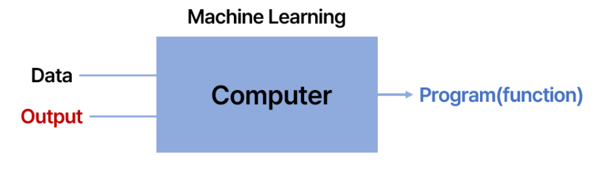

# 딥러닝 입문 week 1

## 머신러닝이란?
### 정의
- Machine(Function) + Learning(Computing Coefficients)
- 기존 프로그래밍은 데이터를 프로그램에 넣어 결과를 얻는 것


- 머신러닝은 데이터와 결과를 컴퓨터에 넣어서 프로그램을 얻는 것



### Machine Learning Problems
- 분류(Classification)
  - Class label 예측
- 회귀(Regression)
  - 정확한 숫자 예측
- 유사성(Similarity)
  - 데이터 간 유사성 분석
- 군집화(Clustering)
  - 데이터 구조 확인
- 특징 추출(Embedding)
  - 데이터를 유의미한 형태의 저차원 벡터로 변환

### Machine Learning Methods
- 지도 학습
  - 정답 값이 있는 데이터로 학습
- 비지도 학습
  - 정답값이 없는 데이터로 학습
- 반지도 학습
  - 일부 데이터만 정답이 있는 데이터로 학습
- 강화 학습
  - 피드백에 의한 학습

### Machine Learning Concepts
#### Training Dataset
모델 학습에 활용되는 데이터
#### Validation(Held-out) Dataset 
- 일반화 성능을 확보하기 위한 데이터
- 모델 훈련에 직접 사용되지 않고, 오직 모델의 성능 평가에만 사용
- 모델을 튜닝

#### Test Dataset 
모델 정확도 측정용 데이터

````
학습 데이터로 모델을 훈련하고, 검증 데이터로 모델을 튜닝하며, 테스트 데이터로 모델의 최종 성능을 평가
````


#### Feature(Representation) 
입력 데이터의 특성을 잘 나타내는 저차원 벡터
#### Evaluation(Test) 
모델의 정확도를 측정하는 과정
#### Overfitting 
과적합, 모델이 학습 데이터를 너무 많이 학습하여 일반화 성능이 떨어지는 현상
#### Generalization 
일반화, 모델이 처음 보는 데이터도 잘 처리할 수 있는 능력

### 머신러닝의 목표 ➡️ Generalization
- 처음보는 데이터도 잘 처리할 수 있어야한다.
- 테스트 셋에 과하게 학습이 되면 처음보는 데이터 처리를 판단하는 능력이 감소한다.

## Basic Math(아는 내용 생략)
### 선형성(Linearity)

- 한 함수 값을 여러 개의 함수로 표현 가능 (중첩의 원리)
- 결과값과 입력값 간의 상관관계 유추 가능

> **선형적으로 분포한다**라는 뜻


- 데이터 집합을 직선을 그어서 구획 가능하다.

> **비선형적으로 분포한다**라는 뜻

- 데이터 집합을 곡선을 그어야만 구획할 수 있다.

## 딥러닝(Deep Learning)
### 딥러닝 특징
- 머신러닝과 별개의 개념이 아니라 머신러닝의 하나의 방법론으로 봐야한다.
  - 학습 데이터 셋을 나타내는 것에 효과적이지만 새로운 데이터 셋을 판단하는데 부족하다.
- overfitting을 막기위해 학습 방법론을 추가해서 최대한 좋은 일반화 성능을 확보하는 것이 중요하다.


- 다른 머신러닝 방법론에 비해 일반화 성능이 좋지 않다.

### 개념
#### 인공신경망(ANN,Artificial Neural Network)
- 뇌의 뉴런에서 영감받은 네트워크 구조


- input들을 행렬로 변환해서 가중치를 곱한 후 다음 레이어로 전달하여 최종적으로 활성함수를 이용해서 모두 더한다.


- 딥러닝의 단점
  - 내부에서 어떤 일이 일어나고 있는지 모른다.
  - Black Box

### 퍼셉트론(Perceptron)
- 원시적 형태의 신경망

- theta는 기준치이다.
- 입력 데이터와 가중치의 선형 합 (Linear Combination)을 기준치와 비교해서 기준치를 넘겨야만 output에 기여한다.
- 가중치가 클수록 더 중요한 신호이다.

- 단일 퍼셉트론의 한계
  - 실제 세계에서 얻어지는 데이터들은 대부분 비선형성을 가진다.
  -  ➡️ 활성화 함수를 추가하여 해결


## 활성화 함수(Activation Function)
### 계단 함수(Step Function)

- 퍼셉트론에서 사용하는 특수한 형태의 활성화 함수
- 임계치를 넘으면 1, 넘지 않으면 0을 반환

### 시그모이드 함수(Sigmoid Function)

- Logistic Function이라고도 부름
- **반환 값을 확률로 해석 가능**
- 단점
  - Vanishing Gradient Problem (기울기 소멸 문제)
    - 후반부에 가서 그래프 기울기가 0에 수렴함
    - 기울기가 0에 수렴한다는 것은 더이상 학습이 일어나지 않는다.
  - 출력값의 중심이 0이 아니라 0.5이기 때문에 신경망의 출력값이 음수를 포함하지 못해 학습이 어려운 경우도 있다.

### thanh 함수
- 은닉층의 시그모이드의 단점을 개선


- 음수값도 커버 가능하다.

### ReLU 함수(Rectified Linear Unit)

- 가장 대중적으로 활용되는 함수
  - 어떤 기울기 함수를 써야할지 모르겠으면 일단 렐루 함수 써도 된다.
- 양수에서 기울기가 항상 1로 일정하므로, 시그모이드의 기울기 소실 문제를 해결할 수 있다.
- 성능도 좋고, 연산량도 작은 편
  - 입력값이 0보다 크거나 같을 때는 입력값을 그대로 출력하고, 0보다 작을 때는 0을 출력합니다.
  - 비교적 적은 분기 연산
    - 값이 음수인지,양수인지만 따진다.
  
### 소프트맥스 함수(Softmax Function)
- 다중 클래스 분류 문제에 활용
- 확률 값으로 해석 가능
- 주로 맨 마지막 층에서 사용한다.
    - 소프트맥스 함수는 입력값들을 확률 분포 형태로 변환
    - 입력에 대한 각 클래스의 예측 확률을 구하여 클래스로 분류할 수 있다.


## 다층 퍼셉트론
### 순전파(Forward Pass, Propagation)
- 방향은 왼쪽에서 오른쪽
- 각 계층에서 가중치와 입력값 간의 행렬곱 진행

### 역전파(Backward Pass, Propagation) 
- 방향은 오른쪽에서 왼쪽
- 입력과 정답간의 오차를 통해 가중치를 갱신

## Overfitting(과적합)
- 모델이 학습 데이터를 과도하게 학습하는 현상
- 과적합 기준

    - train set 기준으로 현재 선택한 모델의 오차가 다른 모델의 오차보다 작지만,
    - test set 기준으로는 현재 선택한 모델의 오차가 더 큰 경우

### Underfitting(과소적합)


### 이 오차 그래프로 최적의 지점을 찾는다.
- Capacity
  - 모델이 데이터를 감당할 수 있는 능력(=복잡도)

- Traning error : 학습 오차
- Generalization error : 실제 오차
- 빨간선이 최적값
- 최적값을 찾는 방법은 정해져 있지 않다. 여러 조건으로 테스트를 하여 찾는 방법밖에...
### Bias Variance tradeoff


- 모델이 복잡할수록 주어진 데이터 분포를 더 정확히 표현 가능(Variance 증가)
- 모델이 가벼울수록 여러 데이터에 유연하게 적응 가능(Bias 증가)  

### Inductive Bias
- 과적합(Overfitting)을 막을 수 있는 방법 중 하나
- ‘데이터들이 아마 ~할 것이다’라는 가정을 임의로 선정해서 주어지지 않은 데이터도 미리 세운 가정을 따를 것이라 예측하는 방식
- 잘 설계된 Inductive Bias는 `일반화 성능 향상`에 매우 큰 도움이 된다
- ex. CNN, Transformer, RNN, Ocaam’s Razor etc..
- 간단할 수록 좋다.(Simple is the Best)
- 데이터 전처리 시에도 유용하다.

## No Free Lunch Theorem
- 완벽한 머신러닝 모델, 알고리즘은 존재하지 않는다.
- 각 데이터마다 특성이 모두 다르기 때문에 각 task에 알맞은 머신러닝 모델이 필요하다
- 이때 인간이 조정할 수 있는 매개변수를 하이퍼파라미터(Hyperparameter)라고 부른다.
