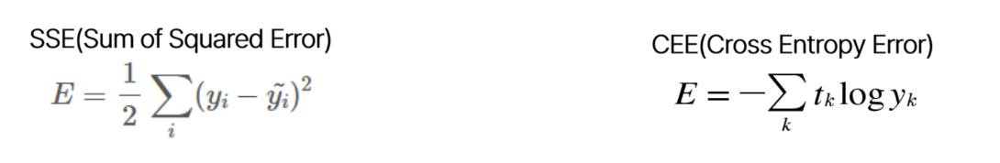
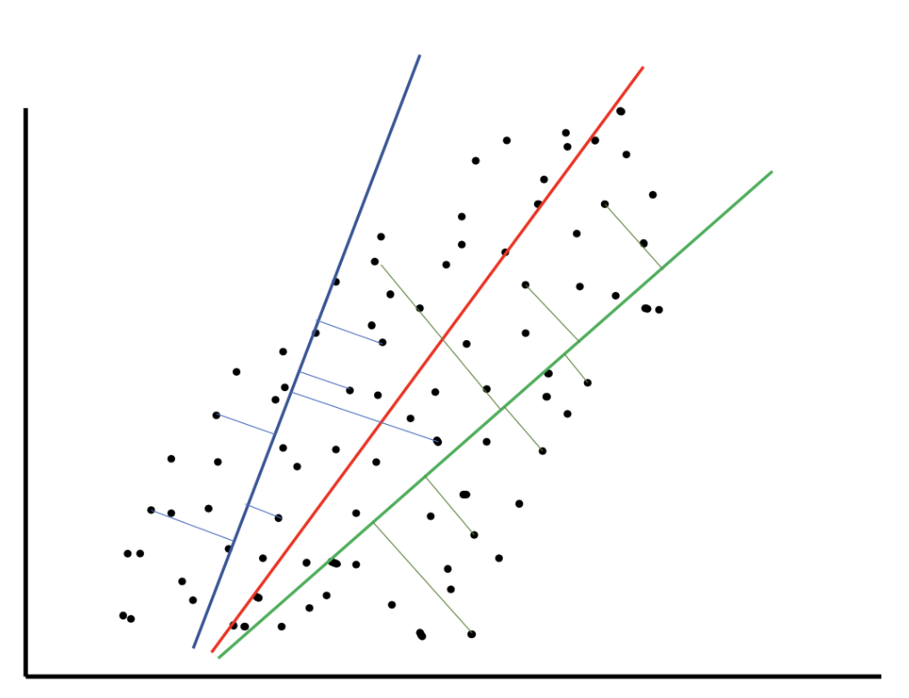
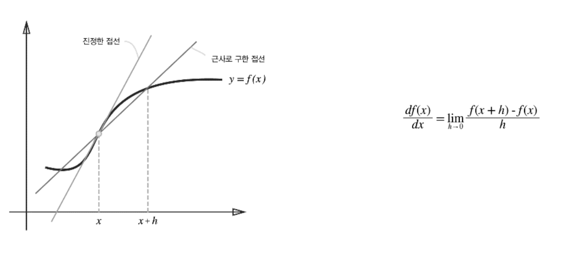
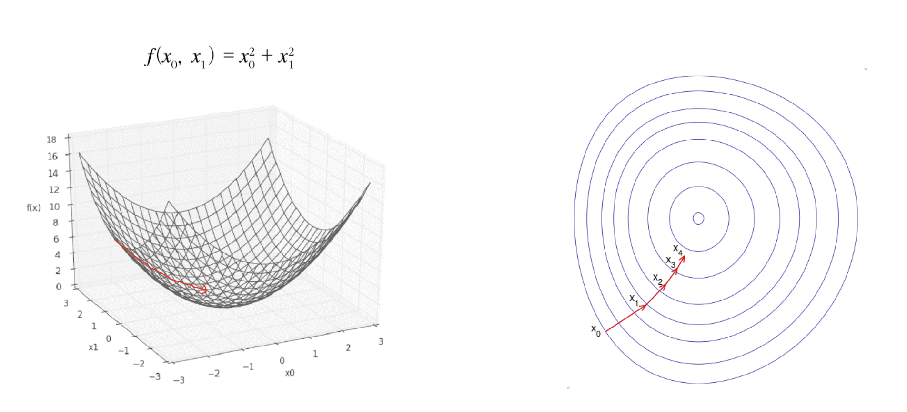
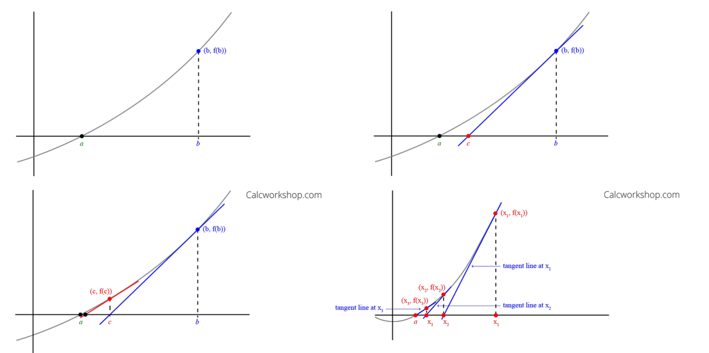
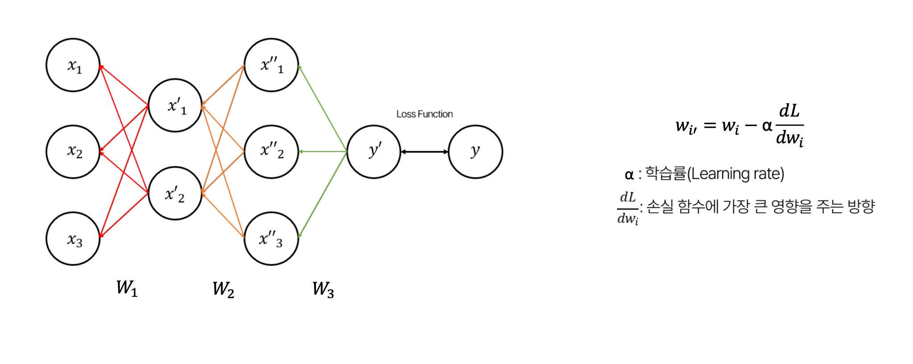
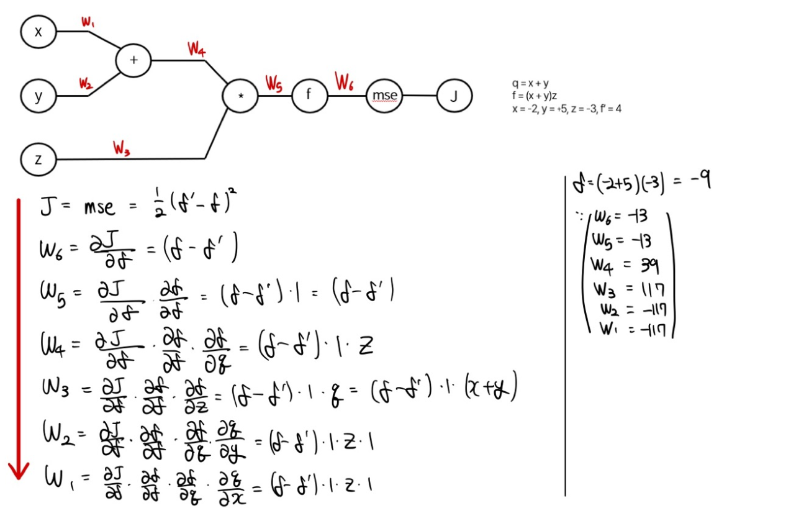
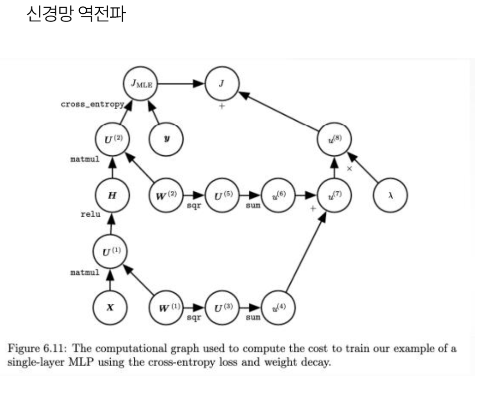
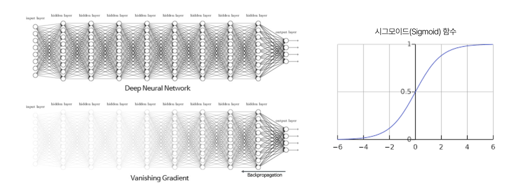
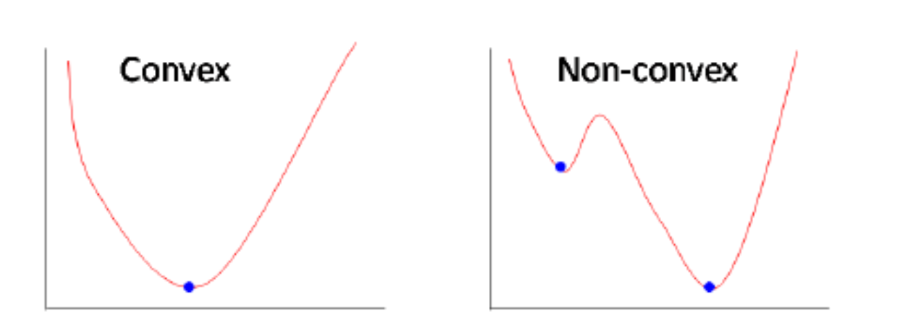

# week2.최적화

## 1. 손실 함수(Loss Function) = 목적함수 (Objective Function)

1. 정답 값과 예측값의 차이를 계산 => 확률
2. 딥러닝 학습의 최종 목표 
    1. 손실 함수를 최소화 하는 가중치 값을 찾는 것
    2. 즉, 정답값과 예측값의 차이를 최소화하는 가중치 찾기
3. 일반화 성능을 확보하는 최고의 방법
: 데이터를 최대한 확보 + 계산
1. but, 학습시 훈련 데이터 셋만 사용하기 때문에 과적합에 빠지거나, 최적화가 쉽지 않을 수 있다.
2. 가장 많이 사용하는 손실함수 2개

(정답값 - 예측값)<br>
1/2를 앞에 곱해주는 이유는 미분시 소거 되도록<br>
SSE의 그래프는 아래와같이 형성된다.


## 2. 경사하강법(Gradient Descent)
1. 손실 함수를 최소화하는 방법 중 가장 간단하며 강력함
    
1. 모델의 가중치(weight)와 편향(bias)을 조절하는데 사용
2. 손실 함수의 기울기(gradient)를 계산
3. 기울기는 현재 가중치와 편향에서 손실 함수가 가장 빠르게 증가 또는 감소하는 방향을 나타낸다.

1. 한계 : saddle point(안장점)
     1. Saddle point는 기울기가 0이 되면서 국소 최솟값(local minimum)도 아니고 국소 최댓값(local maximum)도 아닌 지점을 나타낸다.
     2.  이런 지점에서 경사 하강법은 더 이상 갱신되지 않고 수렴하는 것처럼 보여 학습이 진행되지 않는 문제가 발생한다.
## 3. Neton's method



## 4. 순전파(Forward Propagation)
- 입력 데이터가 신경망을 통과하여 출력을 계산하는 과정
- 예측값과 실제값(타겟) 간의 차이를 계산하여 손실(오차)을 구함
## 5. 역전파(Backpropagation)
- 손실 함수의 기울기(경사)를 계산하고, 이를 사용하여 네트워크의 가중치와 편향을 조정하는 과정
- 손실 함수의 기울기를 계산하기 위해, 역전파는 오류를 네트워크를 거꾸로 따라가면서 각 층에 대한 기울기를 계산
- 계산된 기울기를 사용하여 경사 하강법 또는 그의 변형 알고리즘을 사용하여 가중치를 업데이트하고 모델을 학습시킨다.
- 역전파는 순전파와는 반대 방향으로 오차를 전파하므로 "역전파"라고 불린다.

- wi : 업데이트 하기 전 가중치
- 알파 : 학습률, 얼마나 갈지,직접 지정해야하는 하이퍼 파라미터
아래와 같이 chain rule을 이용하여 가중치를 구한다.

- J : 오차함수
- mse : 평균 제곱 오차 -> 실제값과 모델의 예측값 사이의 차이를 측정

- 실제로는 신경망 역전파는 더 복잡하다
- 파이토치에서 AutoGrad를 사용
- PyTorch:.backward()
```py
import torch

# 입력 데이터와 가중치 생성
x = torch.tensor([2.0], requires_grad=True)
w = torch.tensor([3.0], requires_grad=True)

# 연산 수행
y = x * w

# 손실 함수 정의
loss = y * y

# 역전파 실행
loss.backward()

# 그래디언트 확인
print(x.grad)  # x에 대한 그래디언트 출력
print(w.grad)  # w에 대한 그래디언트 출력

```

### 역전파의 한계
1. 기울기 소실(Gradient Vanishing),기울기 폭주(Gradient Exploding)
- 그래디언트(경사)가 너무 작아져서 가중치가 거의 변하지 않는 문제
-  시그모이드 함수 같은 활성화 함수에서 입력값이 큰 범위에서는 그래디언트가 매우 작아진다.
-  이러한 함수를 사용하면 더 깊은 층으로 갈수록 그래디언트가 더 작아지고, 모델이 수렴하지 않거나, 학습이 더디게 진행된다
-  해결 : 활성화 함수를 수정하거나 Adam과 같은 최적화 모델을 사용한다.

2. Non-convex cost function

- 왼쪽같이 볼록한 함수를 Convex 함수라 하고 그 외에 함수를 Non-convex 함수라고 한다.
- 신경망은 non-covex한 함수라 local-minima에 빠질 확률이 높다.
- 레이어 개수에 따라 Solution space가 변하므로 여러 번 조정이 필요하다.

## GD vs SGD
### Gradient Descent(GD,Batch-wise training)
- 가중치를 한 번 업데이트 할 때 모든 데이터를 사용 -> 업데이트가 안정적
- 이론적으로 명확
- 중요한 Gradient가 서로 상쇄될 가능성 존재
- Computational cost가 높아 실용성이 떨어짐

### Stochastic Gradient Descent(SGD,Mini-Batch-wise training)
- 가중치를 한 번 업데이트 할 때 임의의 배치 하나를 사용 -> 업데이트가 불안정
- 왜 좋은 지 이론적으로 명확하지 않지만 경험적으로 좋다고 알려져있음
- 중요한 Gradient가 보존 가능
- Batch Computation -> 계산 비용이 낮아 실용적