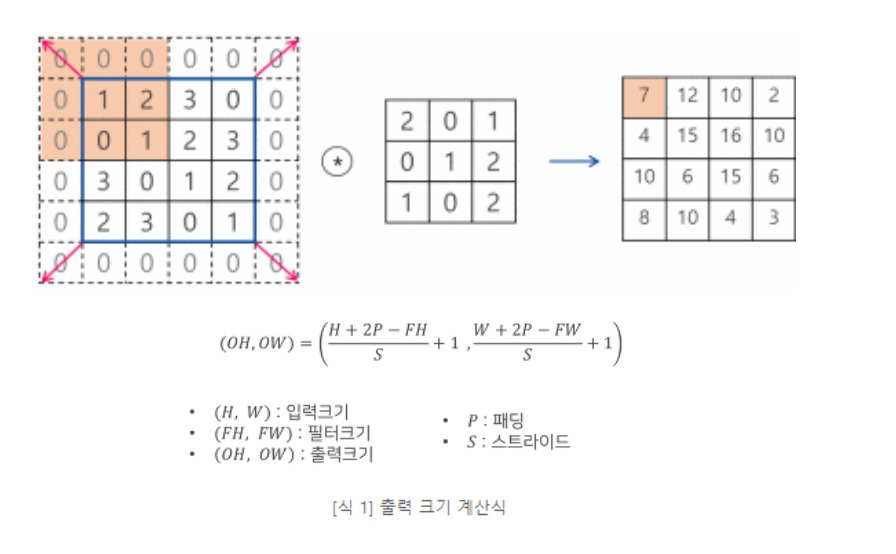

# 합성곱 신경망(CNN,Convolutional Neural Network)
## CNN in Computer Vision
- 기존 신호처리분야에서 활발하게 사용했던 합성곱 개념을 이용

### 합성곱의 수학적 정의
  
  - 두 함수 중 하나(g)를 뒤집고, 다른 하나의 함수와 곱한 결과를 적분

  
   - 이처럼 시간을 따라 두 함수의 관계성을 고려한 새로운 함수를 만드는 과정이다.

## 2d(사진) 에서 합성곱 연산
- 딥러닝에서 합성곱 연산은 기존 1차원 합성곱을 2차원으로 확장시킨 것
- 필터(커널)이 일정한 간격으로 이동해가며 이미지의 각 픽셀값과 합성곱 연산을 진행
- 필터 값들이 가중치 역할을 하며 합슥시에 업데이트 된다.
  

### 작동법
- Stride : 필터가 움직이는 간격
- Padding : 합성곱 연산 이전에 주위를 특정 값으로 채우는 것(주로 0)
- Pooling : 네트워크의 파라미터 개수나 연산량을 줄이기 위해 크기를 줄이는 행위
  - max pooling vs average pooling

## Receptive Field(RF)
- 특정 값에 영향을 주는 입력 이미지의 크기
- CNN 네트워크는 RF를 효과적으로 증진시키는 방향으로 발전해왔음

### 일반적으로 RF를 향상시키는 방법
- CNN 계층을 더 많이 쌓기 (네트워크를 더 깊게)
- Pooling 계층 또는 Stride를 늘리기
- 다양한 Convolution 기법 사용
ex. Dilated Convolution

## Vision Transformer(ViT)

- 기존의 컨볼루션 신경망(CNN) 아키텍처 대신 트랜스포머(Transformer) 구조를 사용하여 이미지 처리를 수행
- 속도가 크게 향상되어 최신 트렌드
- CNN 성능을 뛰어넘음
- 많은 데이터양을 처리해도 연산량이 적은 편

