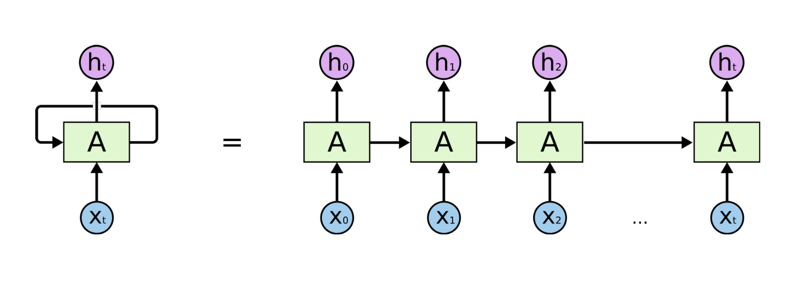
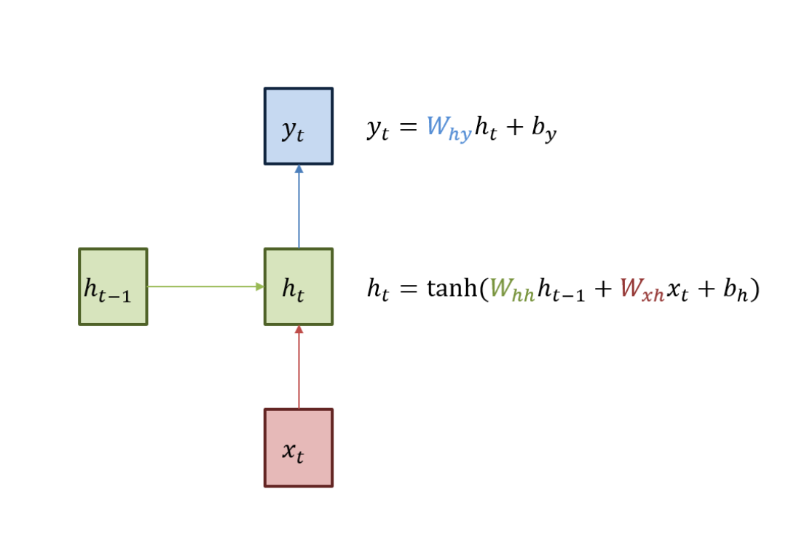
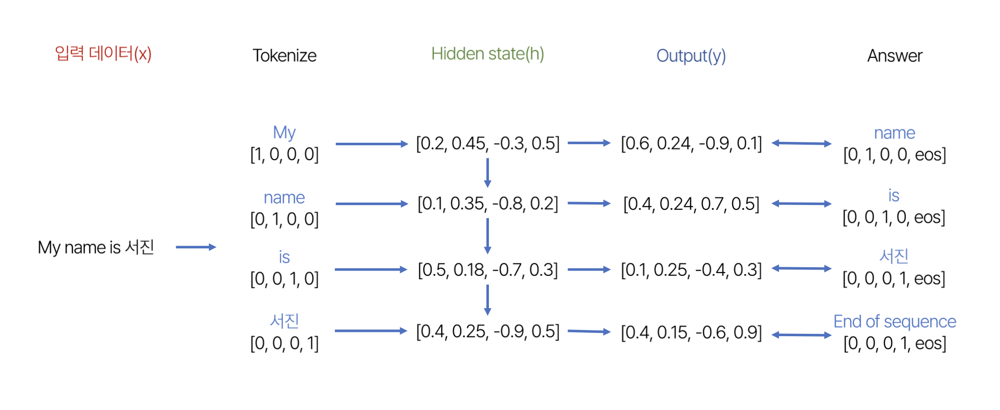

# 자연어 처리(NLP,Natural Language Processing)
- 일상생활에서 사용하는 자연어 의미를 분석하고, 컴퓨터가 처리할 수 있도록 해주는 인공지능 분야
- ex.음성 인식,웹 검색,챗 봇,내용 요약,번역,사용자의 감성 분석
- 즉, 다양한 분야에서 인간의 말을 처리해주는 모델이라고 생각하면 된다.
- 사람과 상호작용하는 모델을 만들 수 있다.

## RNN(Recurrent Network)

### 작동원리

1. 입력 데이터(x)에 가중치(W)를 곱해주고, 편향(b)을 더해준다.
2. 이전 time step(t-1)의 hidden state를 반영해준다.
3. 1,2번 과정을 통해 구한 현재의 hidden state는 결과값(y)를 갱신한다.
4. 현재 time step(t)의 hidden state는 다음 time step에 활용된다.

- NLP는 My name이 나오면 다음 문장을 예측해줄 수 있다.
- 한 문장을 단어별로 Tokenize <= one hot encoding
- 이전 hidden state를 현재 hidden state과 같이 연산 
- 특수한 토큰 : eos (end of sequence) -> 문장의 끝을 나타냄